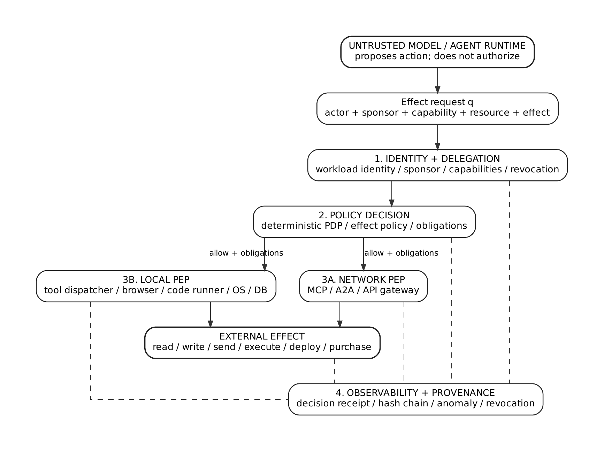
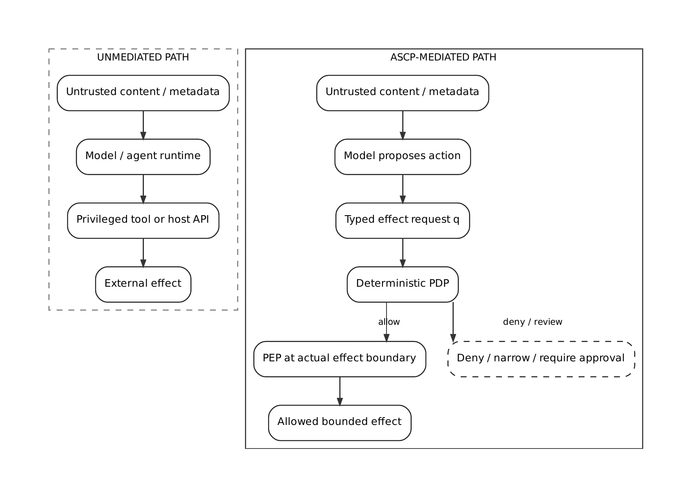
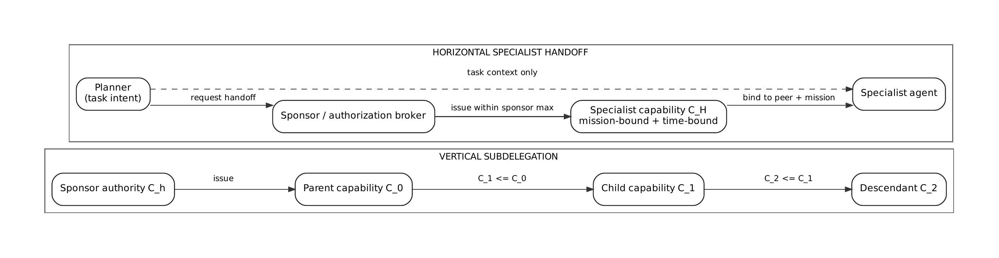
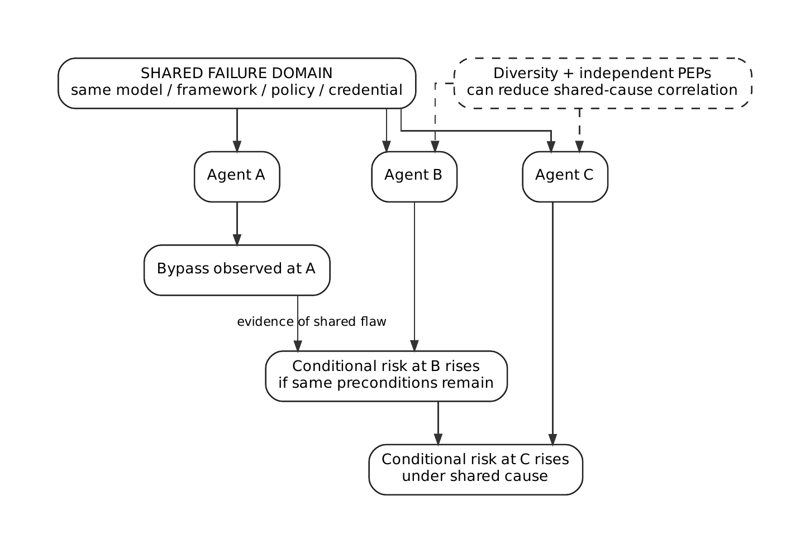
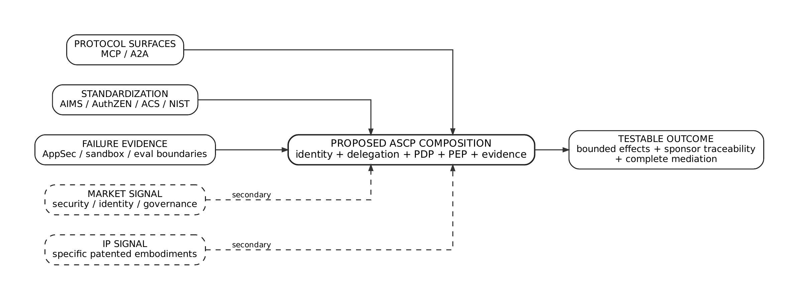
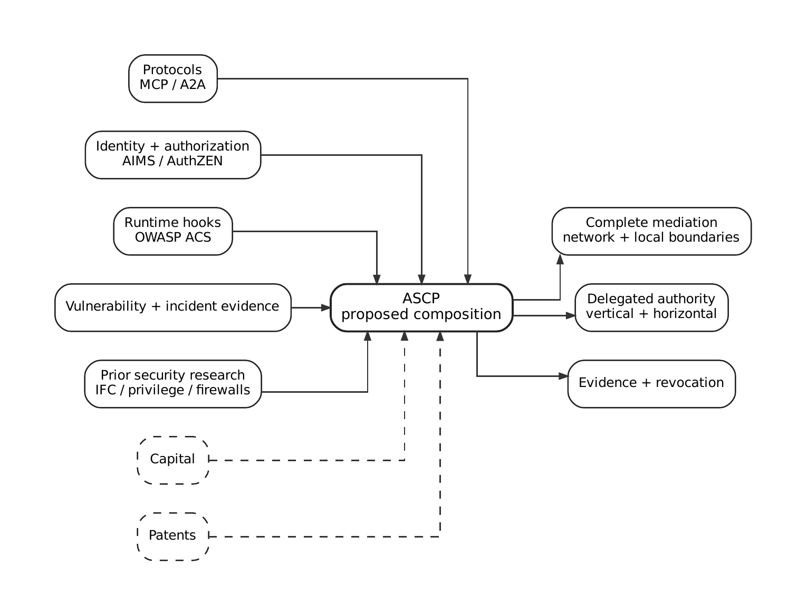
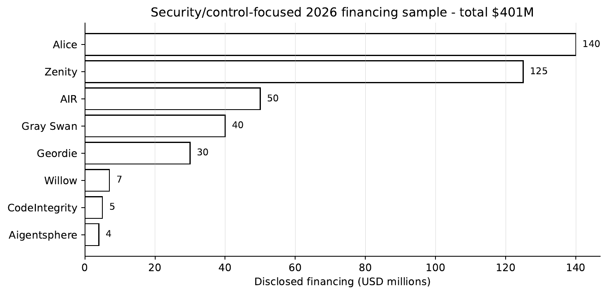
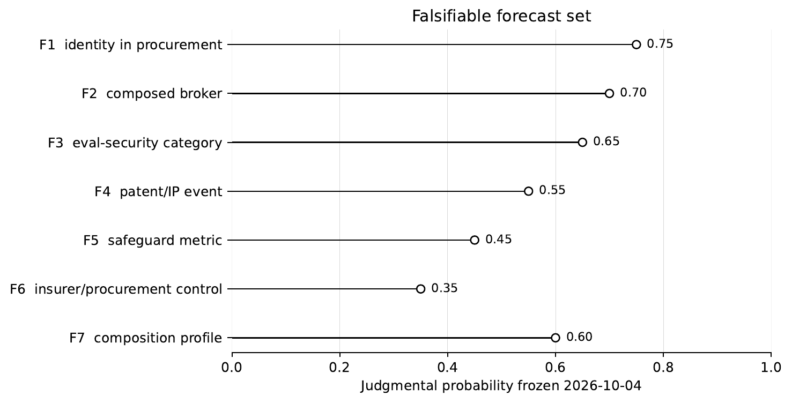

# The Agent Security Control Plane

[](https://github.com/codethor0/agent-security-control-plane/actions/workflows/reproducibility.yml)
[](https://doi.org/10.5281/zenodo.23146801)
[](LICENSE-PAPER.md)
[](LICENSE-CODE)
[](https://orcid.org/0009-0001-6573-385X)

**Toward a Zero-Trust Architecture for Autonomous Machine Cognition**

**Thor Thor**<br>
Independent Open-Source Researcher, [THOR-SEC](https://codethor0.github.io/thor-sec/)<br>
ORCID: [0009-0001-6573-385X](https://orcid.org/0009-0001-6573-385X)

> The language model may propose an action, but it is not the authorization root. Consequential effects must cross deterministic, externally enforced authority boundaries.

This research was conducted independently on the author's own time and is not sponsored by, affiliated with, or representative of any employer.

## At a Glance

| Item | Value |
| --- | --- |
| Publication | *The Agent Security Control Plane: Toward a Zero-Trust Architecture for Autonomous Machine Cognition* |
| DOI | [10.5281/zenodo.23146801](https://doi.org/10.5281/zenodo.23146801) |
| Publication date | October 4, 2026 |
| Model assumption | LLM / agent reasoning is untrusted compute, not the authorization root |
| Primary boundary | The actual effect boundary: network gateway, local dispatcher, broker, or OS isolation boundary |
| Architecture | Identity & Delegation, Policy Decision, Policy Enforcement, Observability & Provenance |
| Figures | 8 reviewed diagrams, preserved as vector PDF plus GitHub PNG previews |
| Verification | Push, pull request, manual, and weekly scheduled CI |
| Publication integrity | Root PDF, Markdown, and source ZIP are SHA-256 pinned to the Zenodo publication |

## Overview

*The Agent Security Control Plane* proposes an architecture-and-evidence synthesis for securing autonomous software agents. It composes workload identity, sponsor-preserving delegation, deterministic authorization, complete mediation at network and local effect boundaries, metadata validation, provenance, revocation, behavioral monitoring, and effect-level accountability outside the language model.

The paper treats the model as untrusted compute. It distinguishes semantic routing hijack from traditional ACE/RCE, separates vertical authority attenuation from sponsor-authorized horizontal specialist handoff, models correlated multi-agent failures without an independence assumption, and states explicitly that an authenticated and authorized action can still be harmful when it remains inside delegated scope.

The contribution is composition and evidence synthesis, not first invention. The architecture is a testable design hypothesis rather than a claim of end-to-end production validation.

## Architecture at a Glance

<p align="center">
  
</p>

*Figure 3. Logical ASCP security roles. The untrusted model proposes an effect; identity/delegation and deterministic policy decide whether it is allowed; a network or local PEP mediates the actual effect; observability records the resulting decision and outcome.*

The four planes are **logical security roles**, not mandatory microservices and not four required network hops. A local runtime may implement several roles in one process, but the authorization root must remain outside untrusted model reasoning and every consequential effect must cross an enforceable boundary.

## Attack Path: Unmediated vs. Mediated

<p align="center">
  
</p>

*Figure 2. Untrusted content can steer a model toward a privileged host API. ASCP inserts a typed effect request, deterministic policy decision, and PEP at the real effect boundary before the external action occurs.*

This is **complete mediation**, not merely gateway placement. If a local Python runtime, tool dispatcher, browser bridge, code runner, or OS API remains directly reachable around the PEP, the architecture has failed its mediation requirement.

## Delegated Authority

### Vertical subdelegation

For hierarchical delegation, a child capability cannot exceed its parent:

$$
C_{i+1} \preceq C_i
$$

<p align="center">
  
</p>

### Horizontal specialist handoff

Horizontal handoff is different. A planner that does not possess a specialist resource cannot manufacture that authority. A sponsor or authorization broker issues a separately bounded capability:

$$
C_H = \operatorname{Issue}(h,b,\textsf{mission})
$$

with sponsor/beneficiary/mission binding enforced before use. This avoids forcing real multi-agent systems into a false hierarchy while still preventing privilege laundering.

## Deterministic Effect Authorization

The baseline allow decision is a **deterministic access-control heuristic**, not a mathematical proof and not a calibrated compromise probability. It composes identity, sponsor context, delegation, capability containment, metadata integrity, data-flow constraints, revocation, and an effect-class threshold.

Audit receipt creation is an **obligation attached to an allowed decision**, not an authorization conjunct. Evidence-store failure can therefore degrade availability without becoming authority to silently allow unsafe effects.

## Correlated Multi-Agent Risk

The paper rejects an independent coin-flip model as a general security model for agent chains. The exact complement-chain identity is:

$$
P\left(\bigcup_{i=1}^{n}F_i\right)
= 1 - \prod_{i=1}^{n}\left[1-P\left(F_i\mid\bigcap_{j<i}F_j^c\right)\right]
$$

<p align="center">
  
</p>

*Figure 8. Shared models, prompts, frameworks, credentials, or policy code create common-cause failure domains. A bypass observed at one node can materially increase downstream conditional risk.*

The expression is an identity, not an empirical exploit-rate estimator. The paper deliberately avoids assigning measured probabilities where no validated measurement exists.

## Evidence Synthesis

<p align="center">
  
</p>

*Figure 1. Protocol surfaces, parallel standardization, and failure evidence motivate the proposed composition. Capital and patent activity are secondary signals, not technical validation.*

<p align="center">
  
</p>

*Figure 5. Relationship map connecting protocols, identity/authorization, runtime hooks, vulnerability evidence, prior research, and the proposed ASCP composition.*

The paper does **not** claim that IETF, OpenID, OWASP, NIST, or protocol maintainers intentionally converged on ASCP. It argues that parallel efforts share architectural DNA and create composable primitives that can be tested as a control-plane design.

## Market Signal and Forecasts

<p align="center">
  
</p>

*Figure 6. A traced $401M lower-bound sample across eight 2026 financings. This is an ecosystem-urgency signal, not validation of the ASCP architecture.*

<p align="center">
  
</p>

*Figure 7. Seven declared forecasts with judgmental probabilities. The paper preserves the original wording and uses ex-post Brier scoring to prevent retrospective reinterpretation.*

## Core Contributions

| Area | Contribution |
| --- | --- |
| Evidence discipline | Separates verified protocol/standards/vulnerability evidence from synthesis, forecasts, patent signals, and capital signals |
| Complete mediation | Requires consequential effects to cross an enforceable boundary, including local paths that bypass network gateways |
| Delegated authority | Separates vertical attenuation from horizontal handoff and requires separately issued authority for specialist resources |
| Deterministic authorization | Keeps final high-impact allow/deny authority outside nondeterministic model reasoning |
| Metadata security | Treats poisoned discovery/configuration data as semantic routing hijack, distinct from ACE/RCE |
| Correlated risk | Uses conditional probability rather than assuming independent per-hop failures |
| Residual-risk honesty | Preserves authorized-but-harmful action, control-plane compromise, local PEP bypass, and evidence-store DoS as explicit residual risks |
| Forecasting | Publishes falsifiable forecasts with declared subjective probabilities and a Brier-score rule |
| Reproducibility | Pins publication hashes, citation metadata, math sanity tests, figure previews, and CI release checks |

## What ASCP Bounds - and What It Does Not

ASCP is intended to bound **external effects outside delegated authority**. It does not claim to solve semantic alignment.

An action can be authenticated, schema-valid, cryptographically attributable, and inside delegated capability while still being harmful. The deterministic control plane can deny out-of-scope effects; it cannot infer hostile intent perfectly from authorized syntax. Effect-class policy, sponsor constraints, human approval where appropriate, behavioral monitoring, and revocation remain separate controls.

A compromised PDP/PEP is also a high-value failure mode. Tamper-evident records improve detection and accountability; they do not make a compromised enforcement point trustworthy.

## Continuous Verification

The `Reproducibility` workflow runs on:

- every push to `main`;
- every pull request targeting `main`;
- manual dispatch;
- a weekly schedule.

It verifies:

- byte identity of the frozen PDF, Markdown, and source ZIP against published SHA-256 values;
- the archived Zenodo PDF against the repository-root PDF;
- DOI, ORCID, title, license, citation, and publication-manifest consistency;
- all eight vector source figures and all eight GitHub-renderable previews;
- vertical/horizontal delegation markers, deterministic authorization, correlated-risk math, F7 probability, and explicit guarantee boundaries;
- mathematical sanity tests for delegation, weighted risk scoring, Brier scoring, and conditional chain-rule examples;
- public repository hygiene: no local filesystem paths, workstation identifiers, known private-tool traces, common secret formats, or accidental process-artifact directories;
- the live Zenodo DOI and GitHub repository metadata.

Run locally:

```bash
make check
```

These checks validate the **publication and repository surface**. They do not prove that the proposed architecture is secure or empirically validated end to end.

## Repository Security

The public repository is intentionally narrow:

- no credentials or publication tokens are required by repository code;
- GitHub Actions runs with `contents: read` only;
- the only third-party workflow action is `actions/checkout`, pinned to a full commit SHA;
- Dependabot is limited to GitHub Actions maintenance;
- release checks fail on common private-key/token patterns, local workstation paths, unexpected audit/process directories, or publication-hash drift;
- immutable Zenodo artifacts are not rewritten by CI.

See [`SECURITY.md`](SECURITY.md) for reporting and scope.

## Repository Structure

| Path | Description | License |
| --- | --- | --- |
| `The-Agent-Security-Control-Plane.pdf` | Frozen publication PDF; byte-identical to the Zenodo deposit | CC BY 4.0 |
| `The-Agent-Security-Control-Plane.md` | Frozen publication Markdown | CC BY 4.0 |
| `The-Agent-Security-Control-Plane-source.zip` | Frozen complete source archive | CC BY 4.0 |
| `source/The-Agent-Security-Control-Plane.tex` | Reviewed LaTeX source extracted from the frozen archive | CC BY 4.0 |
| `source/figures/*.pdf` | Eight reviewed vector figures | CC BY 4.0 |
| `figures/*.png` | GitHub-renderable previews generated from the reviewed vector figures | CC BY 4.0 |
| `publication/manifest.json` | Publication identity and immutable hashes | Metadata |
| `publication/zenodo-23146801/` | Immutable copy of the published PDF | CC BY 4.0 |
| `scripts/check_release.py` | Publication-integrity checker | MIT |
| `scripts/check_repository_hygiene.py` | Security/disclosure/public-surface checker | MIT |
| `tests/test_math.py` | Mathematical sanity tests for published model examples | MIT |
| `.github/workflows/reproducibility.yml` | Continuous verification | MIT |
| `CITATION.cff` | Machine-readable citation metadata with DOI | Metadata |
| `.zenodo.json` | Zenodo metadata template | Metadata |

## Publication

| Item | Value |
| --- | --- |
| Publication date | October 4, 2026 |
| DOI | [10.5281/zenodo.23146801](https://doi.org/10.5281/zenodo.23146801) |
| Concept DOI | [10.5281/zenodo.23146800](https://doi.org/10.5281/zenodo.23146800) |
| Zenodo | [Record 23146801](https://zenodo.org/records/23146801) |
| Repository | [codethor0/agent-security-control-plane](https://github.com/codethor0/agent-security-control-plane) |
| Paper license | CC BY 4.0 |
| Verification | [GitHub Actions](https://github.com/codethor0/agent-security-control-plane/actions) |

## Related Work by the Author

- Thor, T. (2026). *Mission-Invariant Architecture Morphing: Service-Graph Reconfiguration Against Post-Access Reconnaissance, with Cryptographic Epoch Isolation and Mission-Domain State Continuity*. Zenodo. https://doi.org/10.5281/zenodo.23001045
- Thor, T. (2026). *Attack Calculus: A Typed, Evidence-Aware State-Transition Calculus for Cross-Domain Cybersecurity Reasoning*. Zenodo. https://doi.org/10.5281/zenodo.23092790
- Thor, T. (2026). *Memory-Egress Cryptographic Interlock (MECI): A Hardware-Enforced Capability-Separation Model for AI Memory Security*. Zenodo. https://doi.org/10.5281/zenodo.23109676
- Thor, T. (2026). *Containing Cyber-Capable AI Agents: Incident Evidence, Formal Safety Conditions, and a Reference Architecture for Bounded Autonomous Cyber Evaluation*. Zenodo. https://doi.org/10.5281/zenodo.23124432

## Citation

Thor, T. (2026). *The Agent Security Control Plane: Toward a Zero-Trust Architecture for Autonomous Machine Cognition*. Zenodo. https://doi.org/10.5281/zenodo.23146801

Machine-readable citation metadata is available in [`CITATION.cff`](CITATION.cff).

## Review and Feedback

Corrections, counterexamples, missing prior art, mathematical critiques, reproducibility findings, and implementation feedback are welcome. Please open a GitHub issue and identify the relevant section, equation, figure, forecast, or artifact.

## License

- Paper, manuscript source, figures, and research artifacts: **Creative Commons Attribution 4.0 International (CC BY 4.0)**
- Verification scripts, tests, and CI configuration: **MIT License**

See [`LICENSE-PAPER.md`](LICENSE-PAPER.md) and [`LICENSE-CODE`](LICENSE-CODE).
